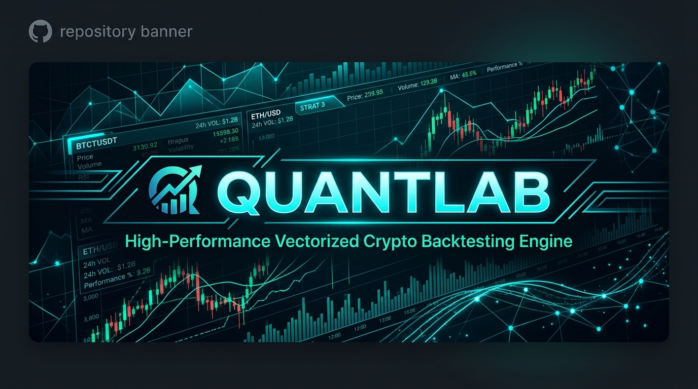
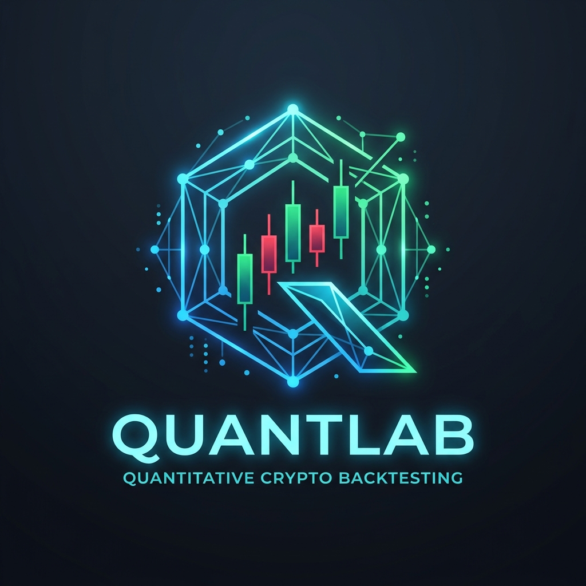
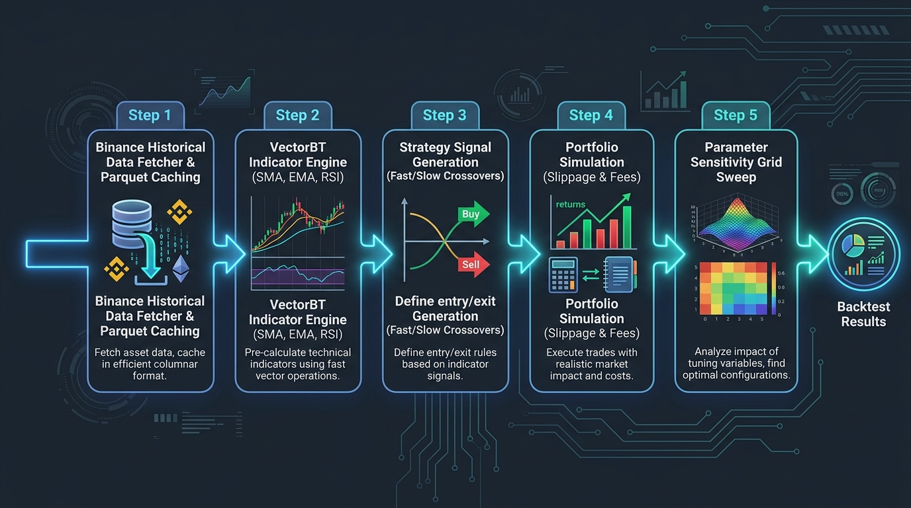

<p align="center">
  
</p>

<p align="center">
  
</p>

<h1 align="center">QuantLab ⚡</h1>

<p align="center">
  <b>High-Performance Vectorized Cryptocurrency Quantitative Backtesting Engine</b>
</p>

<p align="center">
  <i>Accelerated by <code>vectorbt</code> & Powered by Binance Historical OHLCV Data</i>
</p>

<p align="center">
  <a href="https://python.org"></a>
  <a href="https://vectorbt.dev"></a>
  <a href="https://binance.com"></a>
  <a href="https://astral.sh/uv"></a>
  <a href="https://pytest.org"></a>
  <a href="LICENSE"></a>
</p>

<p align="center">
  <a href="#-key-features"><b>Features</b></a> •
  <a href="#%EF%B8%8F-system-architecture"><b>Architecture</b></a> •
  <a href="#-quick-start"><b>Quick Start</b></a> •
  <a href="#-demo-executions--reports"><b>Demos & Reports</b></a> •
  <a href="#-code-api-example"><b>Code API</b></a> •
  <a href="#-project-structure"><b>Project Structure</b></a> •
  <a href="#%EF%B8%8F-roadmap--backlog"><b>Roadmap</b></a>
</p>

---

## 📌 Overview

**QuantLab** is an institutional-grade, vectorized quantitative backtesting system engineered for cryptocurrency strategy research. Built on top of **`vectorbt`** and powered by **`ccxt`** Binance data pipelines, QuantLab enables quantitative analysts and algorithmic traders to backtest, sweep, and screen strategy parameters across thousands of historical price candles in milliseconds.

> [!NOTE]
> Historical market data is fetched directly from **Binance** (chosen for superior historical depth and data quality) and cached locally in compressed **Apache Parquet** format. Execution layers (such as live/paper-trading via Bybit) are strictly decoupled and reserved for post-validation deployment.

---

## ✨ Key Features

| Feature | Description | Tech Stack |
| :--- | :--- | :--- |
| 🪙 **Historical Market Data Engine** | Automated downloading, sanitization, and nanosecond Parquet disk caching for any Binance trading pair and timeframe. | `ccxt`, `pandas`, `pyarrow` |
| ⚡ **Vectorized Indicators** | High-speed calculation of Simple Moving Averages (SMA), Exponential Moving Averages (EMA), and Relative Strength Index (RSI). | `vectorbt`, `numpy` |
| 🎯 **Strategy Signal Generation** | Strict lookahead-free signal matrices for fast/slow moving average crossovers with exact index validation. | `quantlab.strategies` |
| 📈 **Portfolio Simulation Wrapper** | Full portfolio accounting including initial cash, custom fee rates (e.g. 0.1%), and trade slippage (e.g. 0.1%). | `vbt.Portfolio` |
| 🔍 **Parameter Sensitivity Sweeps** | Multi-dimensional grid screening to analyze return surfaces, Sharpe ratios, win rates, and maximum drawdowns. | `quantlab.screening` |
| 📦 **Next-Gen Environment** | Built exclusively with `uv` for reproducible, lightning-fast virtual environment resolution and execution. | `uv` |

---

## 🏗️ System Architecture

QuantLab utilizes a decoupled modular pipeline architecture. Market data flows downwards through vectorized calculation layers into backtesting portfolio simulation and parameter screening engines.

<p align="center">
  
</p>

### 🔄 Data & Execution Flow (Mermaid)

```mermaid
flowchart TD
    subgraph Data Pipeline ["1. Market Data Pipeline"]
        A[Binance Exchange API] -->|CCXT API Request| B[ohlcv.py / get_ohlcv]
        B -->|Check Disk Cache| C{Parquet Exists?}
        C -->|Yes| D[Load Parquet File]
        C -->|No| E[Paginate OHLCV Batches]
        E -->|Save Parquet| F[Local Cache: data/*.parquet]
        F --> D
    end

    subgraph Indicator Engine ["2. Vectorized Indicators"]
        D --> G["quantlab.indicators.trend (SMA / EMA)"]
        D --> H["quantlab.indicators.momentum (RSI)"]
    end

    subgraph Strategy Layer ["3. Signal Generation"]
        G --> I["quantlab.strategies.sma_crossover"]
        I -->|Shift & Vector Logic| J[Entries & Exits Boolean Series]
    end

    subgraph Simulation & Screening ["4. Backtest & Screening Engine"]
        J --> K["quantlab.backtest.engine / run_backtest"]
        D --> K
        K -->|VectorBT Portfolio| L[extract_metrics]
        L --> M[Total Return / Sharpe / Max Drawdown / Win Rate]
        J --> N["quantlab.screening.param_sweep"]
        N -->|Grid Search Sweep| O[Sensitivity Matrix & Report]
    end

    style Data Pipeline fill:#1e293b,stroke:#3b82f6,stroke-width:2px,color:#fff
    style Indicator Engine fill:#0f172a,stroke:#06b6d4,stroke-width:2px,color:#fff
    style Strategy Layer fill:#1e1b4b,stroke:#8b5cf6,stroke-width:2px,color:#fff
    style Simulation & Screening fill:#064e3b,stroke:#10b981,stroke-width:2px,color:#fff
```

---

## ⚡ Quick Start

### 📋 Prerequisites
- Python `>= 3.11`
- [`uv`](https://github.com/astral-sh/uv) (Extremely fast Python package installer and resolver)

### 🚀 Installation & Setup

1. **Clone the Repository**
   ```bash
   git clone https://github.com/DeanT-04/vectrBT-backtesting-engine-crypto.git
   cd vectrBT-backtesting-engine-crypto
   ```

2. **Sync Dependencies with `uv`**
   ```bash
   uv sync
   ```

3. **Run the Test Suite**
   ```bash
   uv run pytest
   ```

---

## 📊 Demo Executions & Reports

QuantLab comes pre-packaged with executable demo scripts located in `scripts/`.

### 1️⃣ Single Strategy Backtest Demo

Run an SMA Crossover (e.g. 20-day Fast / 50-day Slow) backtest on BTC/USDT:

```bash
uv run python scripts/run_backtest_demo.py --symbol BTC/USDT --timeframe 1d --since 2022-01-01 --until 2024-01-01
```

#### 🖥️ Console Output:

```text
=============================================
      SMA CROSSOVER BACKTEST REPORT          
=============================================
Symbol:         BTC/USDT
Timeframe:      1d
Date Range:     2022-01-01 to 2024-01-01
Fast Window:    20
Slow Window:    50
Initial Cash:   $10,000.00
Fees:           0.10%
Slippage:       0.10%
---------------------------------------------
Total Return:   -12.36%
Sharpe Ratio:   -0.04
Max Drawdown:   -46.92%
Win Rate:       22.22%
Total Trades:   9
=============================================
```

---

### 2️⃣ Parameter Sensitivity Sweep Demo

Perform an in-sample exploratory parameter grid search across multiple lookback windows:

```bash
uv run python scripts/param_sweep_demo.py --symbol BTC/USDT --fast-windows 5 10 20 50 --slow-windows 20 50 100 200
```

#### 🖥️ Parameter Sweep Matrix Output:

```text
===========================================================================
           SMA CROSSOVER PARAMETER SCREENING REPORT          
===========================================================================
Symbol:         BTC/USDT
Timeframe:      1d
Date Range:     2022-01-01 to 2024-01-01
Initial Cash:   $10,000.00
Fees:           0.10%
Slippage:       0.10%
---------------------------------------------------------------------------
NOTE: This is an exploratory, in-sample sweep across historical data.
---------------------------------------------------------------------------
  Fast |   Slow |  Total Return |  Sharpe Ratio |  Max Drawdown |   Win Rate |  Trades
--------------------------------------------------------------------------------------
     5 |    200 |        91.91% |          1.26 |       -18.89% |    100.00% |       2
    10 |    200 |        87.69% |          1.22 |       -18.89% |    100.00% |       2
    20 |    100 |        62.99% |          1.01 |       -23.92% |     66.67% |       3
    20 |    200 |        51.36% |          0.88 |       -18.89% |    100.00% |       2
     5 |    100 |        53.60% |          0.88 |       -26.97% |     50.00% |       4
    50 |    200 |        41.63% |          0.76 |       -20.00% |    100.00% |       2
    10 |    100 |        40.00% |          0.72 |       -26.67% |     50.00% |       4
     5 |     50 |        39.84% |          0.67 |       -41.39% |     37.50% |       8
    10 |     50 |        38.52% |          0.65 |       -35.23% |     37.50% |       8
    50 |    100 |        14.33% |          0.38 |       -31.45% |     50.00% |       4
    20 |     50 |       -12.36% |         -0.04 |       -46.92% |     22.22% |       9
     5 |     20 |       -24.03% |         -0.20 |       -58.40% |     22.73% |      22
    10 |     20 |       -32.03% |         -0.34 |       -60.13% |     40.91% |      22
======================================================================================
Best by Sharpe:  Fast=5, Slow=200 (Sharpe=1.26, Return=91.91%)
Worst by Sharpe: Fast=10, Slow=20 (Sharpe=-0.34, Return=-32.03%)
======================================================================================
```

---

## 💻 Code API Example

Using `quantlab` in custom Python scripts is simple and intuitive:

```python
from quantlab.data.ohlcv import get_ohlcv
from quantlab.strategies.sma_crossover import generate_signals
from quantlab.backtest.engine import run_backtest, extract_metrics

# 1. Fetch historical candles (automatically cached to data/*.parquet)
df = get_ohlcv(
    symbol="BTC/USDT",
    timeframe="1d",
    since="2022-01-01",
    until="2024-01-01"
)

# 2. Compute entries & exits via SMA crossover
entries, exits = generate_signals(
    close=df["close"],
    fast_window=10,
    slow_window=200
)

# 3. Simulate portfolio execution with fees and slippage
portfolio = run_backtest(
    close=df["close"],
    entries=entries,
    exits=exits,
    init_cash=10000.0,
    fees=0.001,      # 0.1% fee
    slippage=0.001   # 0.1% slippage
)

# 4. Extract standardized metrics
metrics = extract_metrics(portfolio)

print(f"Total Return: {metrics['total_return'] * 100:.2f}%")
print(f"Sharpe Ratio: {metrics['sharpe_ratio']:.2f}")
print(f"Max Drawdown: {metrics['max_drawdown'] * 100:.2f}%")
print(f"Win Rate:     {metrics['win_rate'] * 100:.2f}%")
```

---

## 📁 Project Structure

```text
quantlab/
├── AGENTS.md                 # Agent behavior rules, scope boundaries, and guidelines
├── .env.example              # Environment variable templates
├── .gitignore                # Git ignore rules for cached parquet data and venvs
├── pyproject.toml            # Project configuration, metadata, and dependencies
├── uv.lock                   # Deterministic lockfile managed by uv
├── docs/
│   └── assets/               # Visual graphic assets (logo, banner, workflow diagram)
├── data/                     # Local parquet cache directory (gitignored)
├── src/
│   └── quantlab/
│       ├── __init__.py       # Package initialization
│       ├── data/
│       │   ├── __init__.py
│       │   └── ohlcv.py      # Binance historical data downloader & parquet cacher
│       ├── indicators/
│       │   ├── __init__.py
│       │   ├── trend.py      # SMA / EMA vectorbt indicator wrappers
│       │   └── momentum.py   # RSI vectorbt indicator wrappers
│       ├── strategies/
│       │   ├── __init__.py
│       │   └── sma_crossover.py # SMA crossover signal generation logic
│       ├── backtest/
│       │   ├── __init__.py
│       │   └── engine.py     # vectorbt Portfolio simulation wrapper & metrics extractor
│       └── screening/
│           ├── __init__.py
│           └── param_sweep.py # Parameter sensitivity grid sweep runner
├── scripts/                  # Runnable CLI entry points & reports
│   ├── run_backtest_demo.py  # Single backtest demo script
│   └── param_sweep_demo.py   # Parameter sweep demo script
└── tests/                    # Comprehensive unit and integration test suite
    ├── backtest/
    ├── data/
    ├── indicators/
    ├── screening/
    ├── scripts/
    └── strategies/
```

---

## 🗺️ Roadmap & Backlog

- [x] **Data Engine**: Binance historical OHLCV fetcher with local Apache Parquet caching (`ccxt` + `pyarrow`).
- [x] **Indicator Suite**: Vectorized wrappers for SMA, EMA, and RSI (`vectorbt`).
- [x] **Strategy Module**: Lookahead-safe SMA Crossover signal generator.
- [x] **Backtest Engine**: Vectorized Portfolio simulation with fee (0.1%) and slippage (0.1%) accounting.
- [x] **Exploratory Screening**: Full parameter grid sensitivity sweeps.
- [x] **Visual Documentation**: Custom high-res logo, hero banner, workflow diagram, and GitHub README design.
- [ ] **Extended Metrics**: Expand `extract_metrics()` with Sortino ratio, Calmar ratio, profit factor, and drawdown duration.
- [ ] **Expanded Indicator Suite**: Add MACD, Bollinger Bands, ATR, and Stochastic indicators.
- [ ] **Incremental Cache**: Partial cache updates for fetching missing day ranges without full redownload.
- [ ] **Validation Harness**: Walk-forward validation harness (rolling training windows, out-of-sample testing).
- [ ] **Monte Carlo Simulation**: Return sequence randomization and trade boot-strapping.
- [ ] **Bybit Execution Layer**: Live & paper trading connector (post-strategy validation).

---

<p align="center">
  Developed with ❤️ by <a href="https://github.com/DeanT-04">DeanT-04</a> for Quantitative Research.
</p>
